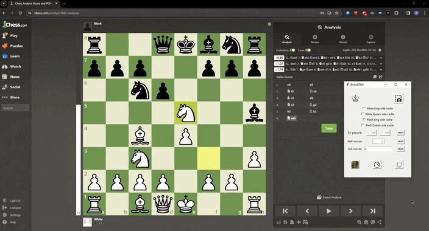

# BoardToFEN

Introduction
-
This repository allows the user to screenshot window on his screen.

If this window contains a digital chessboard, the board will be detected and converted into a URL to the prominent chess 
sites [Chess.com](https://www.chess.com) and [Lichess](https://www.lichess.org). 
Additionally, one could simply copy the [FEN representation](https://www.chess.com/terms/fen-chess) of the given board.

---

Example
-



---

Motivation
-
The motivation of this project has arisen during the time when I studied and analyzed position from digital chess books.

In order to properly analyze the position I came across, sometimes I needed the assistance of a chess engine.

Unfortunately, it would take a while to copy the position to a chess analyzer, and hence this project 😊

---

Getting started
-

To clone the repository use
```bash
git clone https://github.com/DanielGoman/BoardToFEN.git
```

To boot the application interface use
```bash
cd BoardToFEN
pip install -r requirements.txt
EXPORT DISPLAY=:0.0 # Ubuntu only
python main.py
```

---

Dataset
-
The dataset can be found in the following [drive](https://drive.google.com/file/d/1xc9vXlE55g4SCeJNspAnF_j-QJTNaoaZ/view?usp=drive_link)

The zip file contains 4 directories:
- **full_boards** - 34 images of different piece style boards in the starting position
- **replaced_king_queen** - 35 images of different piece style boards with only the queen and king on an opposite 
colored square compared to their starting position
- **squares** - `34 * 64 + 35 * 4` images of each square of those (each square of `full_boards` and only squares that 
contain pieces of `replaced_king_queen`)
- **labels** - json square-level labels files for each file

Importing the dataset
-
To import the dataset into the project directory use
```bash
wget -O "Board2FEN dataset.zip" -r --no-check-certificate 'https://drive.google.com/uc?export=download&id=1xc9vXlE55g4SCeJNspAnF_j-QJTNaoaZ' 
unzip  "Board2FEN dataset.zip" -d dataset/
```
